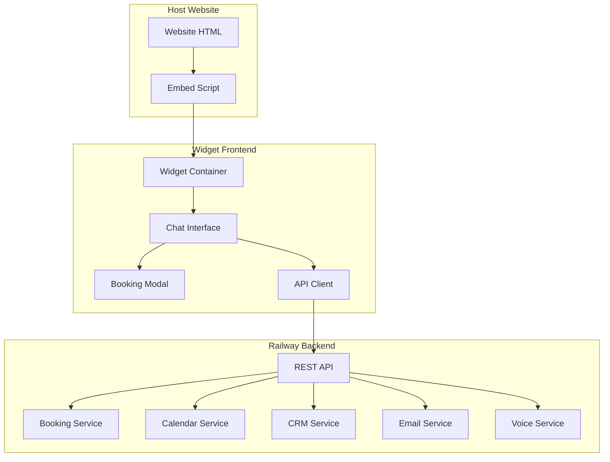
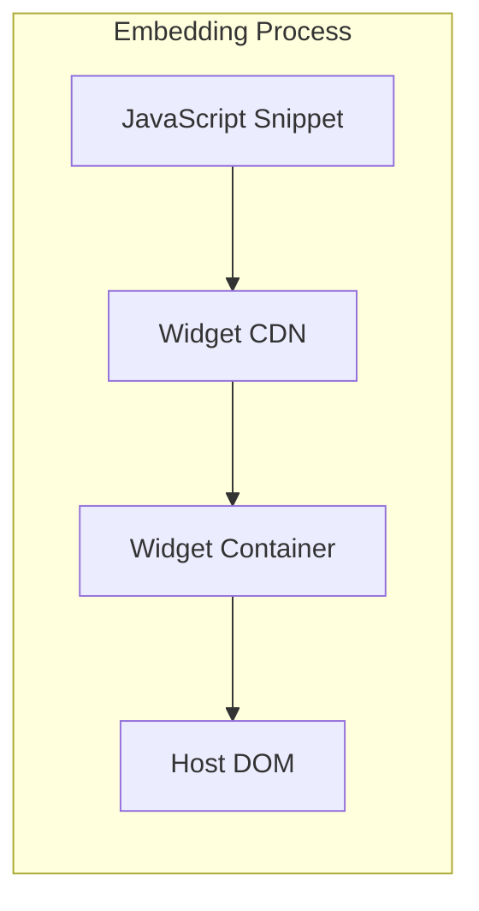

# Design Document: Chatbot Widget

## Overview

The Chatbot Widget is a standalone, embeddable web application that provides an intelligent conversational interface for appointment booking and customer support. The widget features a modern chat interface with a prominent "Book Appointment" button in the header, allowing users to choose between quick form-based booking or natural conversational interactions.

The widget is built as a lightweight, framework-agnostic frontend application that communicates with the existing deployed backend API on Railway. It can be embedded on any website using a simple JavaScript snippet and provides a complete booking and support experience without requiring users to leave the host website.

## Architecture

### High-Level Architecture



### Widget Embedding Architecture



### Component Architecture

The widget follows a modular component architecture:

- **Widget Container**: Root component that manages embedding and isolation
- **Chat Interface**: Main conversational UI with message handling
- **Booking Modal**: Form-based booking interface
- **API Client**: Service layer for backend communication
- **State Manager**: Centralized state management for conversations and bookings
- **Theme Manager**: Handles customization and branding

## Components and Interfaces

### Core Components

#### 1. Widget Container (`WidgetContainer`)

**Purpose**: Root component that handles embedding, isolation, and lifecycle management.

**Key Features**:

- Creates isolated DOM environment (Shadow DOM or iframe)
- Manages widget positioning and responsive behavior
- Handles host website integration without conflicts
- Provides theme and configuration management

**Interface**:

```typescript
interface WidgetContainer {
  initialize(config: WidgetConfig): void;
  show(): void;
  hide(): void;
  destroy(): void;
  updateTheme(theme: ThemeConfig): void;
}

interface WidgetConfig {
  apiBaseUrl: string;
  apiKey: string;
  theme?: ThemeConfig;
  position?: "bottom-right" | "bottom-left" | "top-right" | "top-left";
  customWelcomeMessage?: string;
  enableVoice?: boolean;
}
```

#### 2. Chat Interface (`ChatInterface`)

**Purpose**: Main conversational UI that handles message display, input, and interaction flow.

**Key Features**:

- Message bubble display with typing indicators
- Text and voice input handling
- Conversation context management
- Integration with booking modal
- Header with booking button and controls

**Interface**:

```typescript
interface ChatInterface {
  sendMessage(message: string): Promise<void>;
  receiveMessage(message: ChatMessage): void;
  showTypingIndicator(): void;
  hideTypingIndicator(): void;
  openBookingModal(): void;
  startVoiceInput(): void;
  clearConversation(): void;
}

interface ChatMessage {
  id: string;
  content: string;
  sender: "user" | "assistant";
  timestamp: Date;
  type: "text" | "booking_summary" | "calendar_picker" | "error";
  metadata?: Record<string, any>;
}
```

#### 3. Booking Modal (`BookingModal`)

**Purpose**: Form-based interface for quick appointment booking with calendar integration.

**Key Features**:

- Multi-step form with validation
- Real-time availability calendar
- Service selection and duration display
- Customer information collection
- Booking confirmation and summary

**Interface**:

```typescript
interface BookingModal {
  open(prefilledData?: Partial<BookingData>): void;
  close(): void;
  validateForm(): ValidationResult;
  submitBooking(): Promise<BookingResult>;
  loadAvailability(date: Date): Promise<TimeSlot[]>;
}

interface BookingData {
  customerName: string;
  customerEmail: string;
  customerPhone?: string;
  companyName?: string;
  serviceType: string;
  preferredDate: Date;
  preferredTime: string;
  duration: number;
  notes?: string;
}
```

#### 4. API Client (`APIClient`)

**Purpose**: Service layer that handles all communication with the Railway backend API.

**Key Features**:

- RESTful API communication with authentication
- Request/response handling with error management
- Caching for performance optimization
- Retry logic with exponential backoff
- Session management and token handling

**Interface**:

```typescript
interface APIClient {
  // Authentication
  authenticate(apiKey: string): Promise<AuthResult>;
  refreshToken(): Promise<string>;

  // Conversation
  sendChatMessage(message: string, sessionId: string): Promise<ChatResponse>;
  initializeSession(): Promise<SessionData>;

  // Booking
  getAvailableSlots(date: Date, serviceType: string): Promise<TimeSlot[]>;
  createBooking(bookingData: BookingData): Promise<BookingResult>;
  updateBooking(
    bookingId: string,
    updates: Partial<BookingData>
  ): Promise<BookingResult>;
  cancelBooking(bookingId: string): Promise<void>;

  // Voice
  processVoiceInput(audioBlob: Blob): Promise<VoiceResult>;
  getTextToSpeech(text: string): Promise<AudioBlob>;

  // Analytics
  trackEvent(event: AnalyticsEvent): Promise<void>;
}
```

### Supporting Components

#### 5. State Manager (`StateManager`)

**Purpose**: Centralized state management for conversation history, booking data, and UI state.

**Features**:

- Conversation history persistence
- Booking form state management
- UI state (modal open/closed, loading states)
- Session management
- Local storage integration for offline support

#### 6. Theme Manager (`ThemeManager`)

**Purpose**: Handles widget customization, branding, and responsive design.

**Features**:

- CSS custom properties for theming
- Brand color and font application
- Responsive breakpoint management
- Dark/light mode support
- Custom logo and icon integration

#### 7. Voice Handler (`VoiceHandler`)

**Purpose**: Manages voice input/output integration with the backend Voice_Interface.

**Features**:

- Speech-to-text processing
- Text-to-speech playback
- Audio recording and streaming
- Voice command recognition
- Noise cancellation and audio quality management

## Data Models

### Core Data Models

#### ChatSession

```typescript
interface ChatSession {
  sessionId: string;
  userId?: string;
  startTime: Date;
  lastActivity: Date;
  messages: ChatMessage[];
  context: ConversationContext;
  isActive: boolean;
}

interface ConversationContext {
  customerInfo?: Partial<CustomerInfo>;
  currentIntent?: "booking" | "support" | "information";
  bookingInProgress?: Partial<BookingData>;
  previousBookings?: BookingReference[];
}
```

#### Customer Information

```typescript
interface CustomerInfo {
  name: string;
  email: string;
  phone?: string;
  company?: string;
  timezone: string;
  preferences: CustomerPreferences;
  crmId?: string;
}

interface CustomerPreferences {
  communicationChannel: "email" | "sms" | "both";
  preferredTimes: TimePreference[];
  serviceTypes: string[];
  language: string;
}
```

#### Booking Models

```typescript
interface BookingRequest {
  customerInfo: CustomerInfo;
  serviceType: string;
  preferredDateTime: Date;
  duration: number;
  notes?: string;
  source: "chat" | "modal";
}

interface BookingResult {
  bookingId: string;
  status: "confirmed" | "pending" | "failed";
  appointmentDetails: AppointmentDetails;
  confirmationNumber: string;
  calendarInvite?: string;
  errorMessage?: string;
}

interface AppointmentDetails {
  dateTime: Date;
  duration: number;
  serviceType: string;
  customerInfo: CustomerInfo;
  businessInfo: BusinessInfo;
  meetingLink?: string;
  location?: string;
}
```

#### UI State Models

```typescript
interface WidgetState {
  isVisible: boolean;
  isMinimized: boolean;
  currentView: "chat" | "booking_modal" | "calendar_view";
  isLoading: boolean;
  connectionStatus: "connected" | "disconnected" | "reconnecting";
  errorState?: ErrorState;
}

interface ErrorState {
  type: "network" | "api" | "validation" | "booking";
  message: string;
  isRetryable: boolean;
  retryCount: number;
}
```

## Correctness Properties

_A property is a characteristic or behavior that should hold true across all valid executions of a system-essentially, a formal statement about what the system should do. Properties serve as the bridge between human-readable specifications and machine-verifiable correctness guarantees._

<function_calls>
<invoke name="prework">
<parameter name="featureName">chatbot-widget

### Property Reflection

After analyzing all acceptance criteria, I identified several areas where properties can be consolidated to eliminate redundancy:

**Performance Properties**: Load time (1.2) and API response time (10.2) can be combined into a comprehensive performance property.

**Error Handling Properties**: Network interruption handling (10.3), backend unavailability (10.6), and retry logic (12.5) can be consolidated into a comprehensive error handling property.

**Customization Properties**: Theme application (8.1, 8.2), positioning (8.4), sizing (8.5), and branding (8.6) can be combined into a comprehensive customization property.

**Security Properties**: HTTPS encryption (9.1), input validation (9.2), and secure storage (9.6) can be consolidated into a comprehensive security property.

**Analytics Properties**: Engagement tracking (11.1), error logging (11.3), and performance tracking (11.5) can be combined into a comprehensive analytics property.

### Correctness Properties

Based on the prework analysis, here are the key correctness properties that must hold for the chatbot widget:

**Property 1: Widget Loading Performance**
_For any_ standard internet connection and valid embed configuration, the widget should load and display within 3 seconds, and all API responses should be received within 2 seconds under normal conditions.
**Validates: Requirements 1.2, 10.2**

**Property 2: Cross-Platform Compatibility**
_For any_ screen size, device type, or major browser (Chrome, Firefox, Safari, Edge), the widget should display correctly and maintain full functionality without interfering with host website styling.
**Validates: Requirements 1.3, 1.4, 10.4, 10.5**

**Property 3: Comprehensive Customization**
_For any_ valid theme configuration, positioning setting, size option, or branding element, the widget should apply the customization correctly while maintaining usability and functionality.
**Validates: Requirements 1.5, 8.1, 8.2, 8.4, 8.5, 8.6**

**Property 4: Session and Context Management**
_For any_ user interaction or conversation flow, the widget should maintain proper session tokens, conversation context, and state persistence throughout the entire user session.
**Validates: Requirements 2.1, 2.5, 12.6**

**Property 5: Message Processing and Display**
_For any_ user message input (text or voice), the widget should send it to the backend API, display appropriate loading indicators, and show the AI response with proper formatting.
**Validates: Requirements 2.2, 2.7, 7.3**

**Property 6: Booking Flow Completeness**
_For any_ booking request scenario, the widget should guide users through the complete booking process, collect required information, check availability, create appointments, and display booking summaries.
**Validates: Requirements 3.1, 3.2, 3.3, 3.4, 3.8**

**Property 7: Availability and Calendar Integration**
_For any_ availability request with valid date ranges and service types, the widget should retrieve real-time availability from the backend and display it in an intuitive calendar interface with proper timezone handling.
**Validates: Requirements 4.1, 4.2, 4.6**

**Property 8: CRM and Lead Management**
_For any_ customer interaction, the widget should capture and send customer information, conversation history, and lead data to the backend CRM system, even for incomplete bookings.
**Validates: Requirements 5.1, 5.2, 5.4, 5.5**

**Property 9: Multi-Channel Communication**
_For any_ confirmed booking or customer interaction, the widget should offer appropriate communication options (SMS, calendar invites, email preferences) and handle them through backend API calls.
**Validates: Requirements 6.2, 6.4, 6.6**

**Property 10: Voice Interface Integration**
_For any_ voice interaction, the widget should provide voice input buttons, send audio to the backend voice interface, process voice-converted text, and handle text-to-speech requests when needed.
**Validates: Requirements 7.1, 7.3, 7.4**

**Property 11: Comprehensive Security**
_For any_ user input, API communication, or data handling, the widget should use HTTPS encryption, validate and sanitize inputs, implement proper consent mechanisms, and never store sensitive information in local storage.
**Validates: Requirements 9.1, 9.2, 9.3, 9.6**

**Property 12: Comprehensive Error Handling**
_For any_ network interruption, backend unavailability, or API failure, the widget should handle errors gracefully, display appropriate messages, provide fallback options, and implement automatic retry with exponential backoff.
**Validates: Requirements 10.3, 10.6, 12.1, 12.2, 12.3, 12.4, 12.5**

**Property 13: Rate Limiting and Session Security**
_For any_ API communication pattern, the widget should implement proper rate limiting to prevent abuse and maintain secure session management with timeout handling.
**Validates: Requirements 9.5, 9.7**

**Property 14: Comprehensive Analytics**
_For any_ user interaction, error occurrence, or performance event, the widget should track and send appropriate metrics to the backend API for analysis and integrate with configured analytics platforms.
**Validates: Requirements 11.1, 11.3, 11.5, 11.6**

**Property 15: Booking Conflict Resolution**
_For any_ booking conflict scenario, the widget should receive alternative time slots from the backend and display them to users for selection.
**Validates: Requirements 3.7**

**Property 16: Availability Refresh**
_For any_ availability change during an active conversation, the widget should refresh availability data from the backend API and update the displayed options.
**Validates: Requirements 4.4**

**Property 17: Clarification Handling**
_For any_ ambiguous or unclear user query, the widget should display clarifying questions received from the backend AI assistant.
**Validates: Requirements 2.4**

**Property 18: Booking Modification Support**
_For any_ valid existing booking, the widget should handle modification and cancellation requests through backend API calls.
**Validates: Requirements 3.6**

**Property 19: Cache Performance Optimization**
_For any_ frequently accessed backend API data, the widget should implement appropriate caching to improve performance while maintaining data freshness.
**Validates: Requirements 10.7**

## Error Handling

### Error Categories and Handling Strategies

#### 1. Network and Connectivity Errors

**Scenarios**: Internet connection loss, DNS failures, network timeouts
**Handling Strategy**:

- Display offline indicator with queue message functionality
- Implement automatic reconnection with exponential backoff
- Maintain conversation state during temporary disconnections
- Provide manual retry options for users

#### 2. Backend API Errors

**Scenarios**: API unavailability, authentication failures, rate limiting, server errors
**Handling Strategy**:

- Categorize errors by type (temporary vs permanent)
- Display user-friendly error messages with clear next steps
- Provide fallback contact methods when booking services are unavailable
- Implement circuit breaker pattern for repeated failures

#### 3. Booking and Calendar Errors

**Scenarios**: Booking conflicts, calendar sync failures, invalid time slots
**Handling Strategy**:

- Present alternative time slots for conflicts
- Gracefully handle calendar integration failures
- Validate booking data before submission
- Provide clear feedback on booking status

#### 4. Voice and Input Errors

**Scenarios**: Microphone access denied, speech recognition failures, audio processing errors
**Handling Strategy**:

- Fallback to text input when voice fails
- Clear error messages for permission issues
- Retry mechanisms for temporary audio processing failures
- Progressive enhancement approach (voice as enhancement, not requirement)

#### 5. Validation and Security Errors

**Scenarios**: Invalid input data, security violations, authentication timeouts
**Handling Strategy**:

- Client-side validation with clear error messaging
- Sanitization of all user inputs before API transmission
- Automatic session refresh for authentication timeouts
- Rate limiting with user-friendly feedback

### Error Recovery Patterns

#### Retry Logic

```typescript
interface RetryConfig {
  maxAttempts: number;
  baseDelay: number;
  maxDelay: number;
  backoffMultiplier: number;
  retryableErrors: string[];
}
```

#### Circuit Breaker

- Open circuit after consecutive failures
- Half-open state for testing recovery
- Closed circuit for normal operation
- Fallback mechanisms for each circuit state

## Testing Strategy

### Dual Testing Approach

The chatbot widget requires both **unit testing** and **property-based testing** to ensure comprehensive coverage and correctness.

#### Unit Testing Focus

Unit tests will verify specific examples, edge cases, and integration points:

- **Component Integration**: Test that components communicate correctly
- **API Integration**: Test specific API endpoints and response handling
- **UI Interactions**: Test button clicks, form submissions, modal operations
- **Error Scenarios**: Test specific error conditions and recovery
- **Browser Compatibility**: Test specific browser features and polyfills
- **Accessibility**: Test keyboard navigation, screen reader compatibility

#### Property-Based Testing Focus

Property tests will verify universal properties across all inputs using **fast-check** library:

- **Performance Properties**: Load times, response times across various conditions
- **Security Properties**: Input validation, sanitization across all input types
- **Customization Properties**: Theme application across all valid configurations
- **Booking Properties**: Booking flows across all valid booking scenarios
- **Error Handling Properties**: Error recovery across all failure modes
- **Cross-Platform Properties**: Functionality across all supported platforms

#### Property-Based Testing Configuration

**Library**: fast-check (JavaScript/TypeScript property-based testing library)
**Test Configuration**: Minimum 100 iterations per property test
**Test Tagging**: Each property test must reference its design document property

**Example Property Test Structure**:

```typescript
// Feature: chatbot-widget, Property 1: Widget Loading Performance
describe("Widget Loading Performance", () => {
  it("should load within 3 seconds for any valid configuration", () => {
    fc.assert(
      fc.property(
        fc.record({
          apiBaseUrl: fc.webUrl(),
          apiKey: fc.string({ minLength: 10 }),
          theme: fc.option(validThemeArb),
          position: fc.constantFrom(
            "bottom-right",
            "bottom-left",
            "top-right",
            "top-left"
          ),
        }),
        async (config) => {
          const startTime = Date.now();
          const widget = new WidgetContainer();
          await widget.initialize(config);
          const loadTime = Date.now() - startTime;
          expect(loadTime).toBeLessThan(3000);
        }
      ),
      { numRuns: 100 }
    );
  });
});
```

#### Testing Environment Setup

**Unit Testing Stack**:

- **Framework**: Jest or Vitest
- **DOM Testing**: @testing-library/dom
- **Mocking**: MSW (Mock Service Worker) for API mocking
- **Browser Testing**: Playwright for cross-browser testing

**Property Testing Stack**:

- **Library**: fast-check
- **Generators**: Custom generators for widget configurations, user inputs, API responses
- **Integration**: Property tests integrated with unit test runner
- **Coverage**: Property tests complement unit tests for comprehensive coverage

#### Test Data Generation

**Smart Generators for Property Tests**:

- **Widget Configurations**: Generate valid theme, positioning, and API configurations
- **User Inputs**: Generate realistic chat messages, booking data, voice inputs
- **API Responses**: Generate valid and invalid API responses for error testing
- **Browser Environments**: Generate different screen sizes, user agents, network conditions
- **Booking Scenarios**: Generate valid appointment times, customer data, service types

The combination of unit tests for specific scenarios and property tests for universal correctness ensures the widget works reliably across all possible user interactions and configurations.
